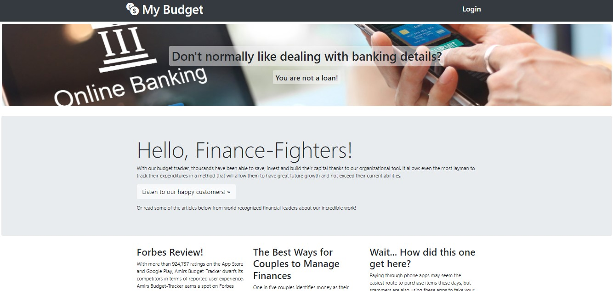

# My Budget

### Overview
This application dynamically and safely displays the user's sensitive budgeting information once authenticated.

### Table of Contents
- [Overview](#overview)
- [Application Demo](#application-demo)
- [Features Used](#features-used)
- [How to Use](#how-to-use)
- [Contributors](#contributors)
- [Live Application](#live-application)

### License

### Application Demo

### Features Used
| Feature       | Summary                                                                                                  | 
| ------------- | -------------------------------------------------------------------------------------------------------- |
| React JS | Dynamic JavaScript library. |
| Bootstrap | Dynamic CSS library. |
| MongoDb | NoSQL database used to store user and transaction. |
| JWT | JSON Web Token is used to authenticate logged in users to display sensitive information safely. |

### How to Use
* Enter: https://amir-mybudget.herokuapp.com/ into your address bar.
* 
* 
* 
* 
* 
* 

### Contributors
- [Kole Ervine](https://github.com/BullMooseDev)
- [Amir Shariat](https://github.com/AShariat)
- [Rachel Marriott](https://github.com/Rachel8078)
- [Casey Chamberlain](https://github.com/KCaseyChamberlain)
- [Jordan Otterson](https://github.com/Otterpop7)

### Live Application

[My Budget](https://amir-mybudget.herokuapp.com/)